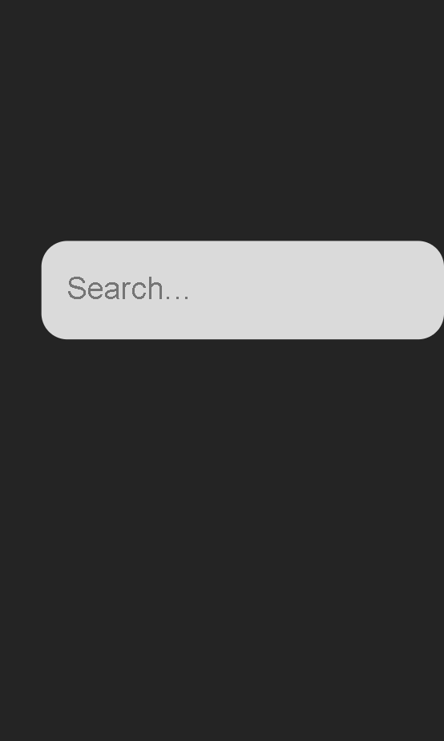

# Weather PWA

Weather PWA is a Web Application that display city weather 
Weather PWA is optimize for mobile devices

## Built with

## Intall and Run
- Clone the repository from `https://github.com/david-lafontant/WeatherPWA.git` with 

## Mobile version

## Built With

## Live Demo

[Live Demo Link](https://strong-druid-5b1496.netlify.app/)

## Getting Started

To get a local copy up and running follow these simple example steps.

### Prerequisites

- A device that support running browser applications.
- access to internet connection.

### Setup

#### View pages from the browser

- If you just want to check the webpage/webapp, you have it available on the live demo link.

#### Install locally the code of the application

In order to install a local version of this project and please do the following steps:
- Install the latest version of a Code editor.
- install the latest version of GIT. 
- Go to the repository [Repository](https://github.com/david-lafontant/WeatherPWA.git)
- Clone the repository with `git clone https://github.com/david-lafontant/WeatherPWA.git`
  
- run `npm i` to install all the dependencies required
- run `npm run dev` to run in the browser

## Author

👤 **David Lafontant**

- GitHub: [@david-lafontant](https://github.com/david-lafontant)
- Twitter: [@manikatex](https://twitter.com/manikatex)

## 🤝 Contributing

Contributions, issues, and feature requests are welcome!

Feel free to check the [issues page](../../issues/).

## Show your support

Give a ⭐️ if you like this project!

## Acknowledgments

👤 **JavaScript Mastery**

- [Tutorial](https://www.youtube.com/watch?v=IaJqMcOMuDM)

## Other Resources

## 📝 License

This project is [MIT](LICENCE.md) licensed.